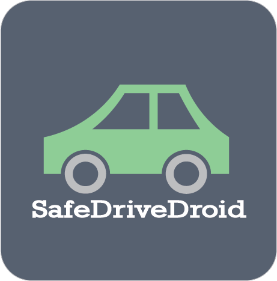

  

SafeDriveDroid is a simple and easy to use Android app that blocks all the incoming calls and messages when the driver is driving a vehicle. The drive mode is auto enabled after the speed of the vehicle increases above 20 km/hr. The app detects if you are in accident and also sends the driver's current location to his 3 priority contacts. The drive mode can also be enabled manually. The messages and calls that were blocked are sent to the driver after the drive mode is disabled. The app also auto replies to the callers. In case of emergency calls/caller id the app notifies the driver using voice. The driver can set his priority contacts. The app also notifies the driver using voice if the speed limit is exceeded than the speed limit of the road on which he/she is driving. This app won the Smart India Hackathon 2018.

